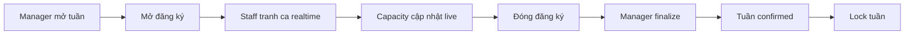
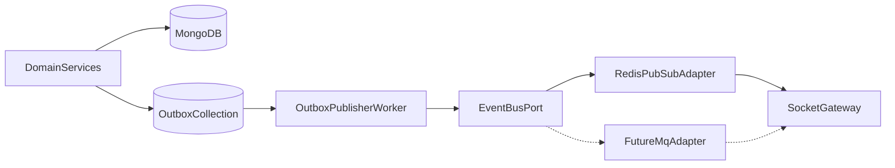

# MASTER ROADMAP — Shiftalyst

**Mục đích:** Nguồn sự thật duy nhất về tầm nhìn sản phẩm và lộ trình dài hạn.  
**Cập nhật:** 2026-04  
**Phân biệt với tài liệu khác:**
- `docs/spec.md` → API contract, domain model, business rules  
- `docs/tasks.md` → tiến độ thực thi hàng ngày, gap kỹ thuật ngắn hạn

**Cách dùng:** Chỉ chỉnh sửa file này khi đổi hướng sản phẩm hoặc điều chỉnh phase. Ghi vào [Lịch sử chỉnh sửa](#lịch-sử-chỉnh-sửa) mỗi khi thay đổi.

---

## Trạng thái hiện tại

### Nghiệp vụ đã hoàn thành (B01–B26)

| Nhóm | Modules | Trạng thái |
|------|---------|------------|
| Auth | B01, B02, B02.1, B02.2 | ✅ Register / Login / Refresh / Logout |
| Group core | B03, B04, B05, B05.1 | ✅ Tạo group, join, duyệt thành viên, audit logs |
| Shift foundation | B06, B07, B09, B10 | ✅ Position, Shift template, Shift, Requirement |
| Member flow | B08, B11, B12, B13, B19 | ✅ Availability, đăng ký ca, lịch cá nhân |
| Manager ops | B14–B18, B20 | ✅ Duyệt/gán ca, cảnh báo thiếu người, gợi ý, lock shift |
| Shift change | B21, B22 | ✅ Tạo & duyệt yêu cầu đổi ca |
| Payroll/report | B24, B25, B26 | ✅ Salary config, payroll tháng, báo cáo hoạt động |
| System admin | B23 | ✅ User/group governance, metrics, admin audit |

### Gap kỹ thuật còn lại

| Mức | Hạng mục | Trạng thái |
|-----|----------|------------|
| P0 | Automated tests (auth, RBAC, registration, shift change, payroll) | Chưa có |
| P0 | CI pipeline (lint + test + build) | Chưa có |
| P1 | Observability: structured logging, request correlation ID | Chưa có |
| P1 | Rate limiting cho auth/refresh endpoints | Chưa có |
| P2 | MongoDB index review cho query tần suất cao | Chưa làm |

---

## Lộ trình tổng quan

| Giai đoạn | Tên | Thời gian ước tính | Trạng thái |
|-----------|-----|-------------------|------------|
| **G0** | Nền tảng kỹ thuật | ~12 tuần | 🔄 Đang thực hiện |
| **G1** | Realtime & Concurrency | ~15 ngày (sau G0) | ⏳ Chưa bắt đầu |
| **G2** | Smart Scheduling | ~1 tháng (sau G1) | ⏳ Chưa bắt đầu |
| **G3** | Quản lý toàn diện | ~2 tháng (sau G2) | ⏳ Chưa bắt đầu |
| **G4** | Sản phẩm thương mại | ~3 tháng (sau G3) | ⏳ Chưa bắt đầu |

---

## Giai đoạn 0 — Nền tảng kỹ thuật (~12 tuần)

> Mục tiêu: đảm bảo codebase sạch, có tests, có CI, đủ điều kiện mở rộng an toàn.

| Phase | Tuần | Mục tiêu | Definition of Done |
|-------|------|----------|--------------------|
| **A** | 1–2 | Hoàn tất frontend refactor (cấu trúc `components/`, `services/`, `configs/`, `states/`, `hooks/`) | Không còn import cũ; full flow login→group→shift→payroll chạy sạch |
| **B** | 3–5 | Thiết lập Jest/Vitest + integration tests cho luồng trọng yếu | Coverage có ý nghĩa ở auth, RBAC, registration, shift change, payroll |
| **C** | 6–7 | CI/CD: GitHub Actions lint + test + build + Docker | Mỗi PR phải pass checks; Docker image build thành công trên CI |
| **D** | 8–9 | Production hardening: rate limit, structured logging, MongoDB indexes | P95 latency list/report ổn định; có playbook xử lý sự cố |
| **E** | 10–12 | Polish: UX admin/report, export format, release checklist | Demo end-to-end đủ cho manager/member/admin; docs release dùng được ngay |

---

## Giai đoạn 1 — Realtime & Concurrency (~15 ngày sau G0)

> Mục tiêu: đưa hệ thống đăng ký ca lên realtime, xử lý tranh ca an toàn dưới tải đồng thời.

| Phase | Tên | Nội dung chính | Phụ thuộc |
|-------|-----|----------------|-----------|
| **P01** | MQ-ready: Outbox + EventBus | Collection `outbox`; `DomainEvent` envelope; `EventBus` interface; worker poll + publish (Redis Pub/Sub); outbox insert **cùng transaction** với mutation | — |
| **P02** | WebSocket gateway | Socket.IO gắn vào bootstrap; JWT verify khi connect; join room `group:{groupId}` theo membership | P01 |
| **P03** | Đăng ký realtime | Claim/release slot qua service; sau commit có outbox event; gateway broadcast capacity xuống room | P01, P02 |
| **P04** | Concurrency an toàn | Mongo transaction; unique constraint (user+shift); idempotency key; Redis lock ngắn TTL quanh check quota | P03 |
| **P05** | Redis cache + backplane | Cache shifts theo tuần/group; TTL + degrade graceful; invalidation theo event; stampede protection | P01, P03 |
| **P06** | Frontend realtime UI | Socket hook; subscribe theo group; map event → `loadData`; availability UI sáng/tối + tooltip | P02–P05 |
| **P07** | Vận hành | Feature flag realtime (rollback REST-only); env Redis/socket; load test concurrent claim | P01–P06 |

### Workflow "Tranh ca" (mục tiêu G1)



**Trạng thái tuần:** `DRAFT → OPEN_REGISTRATION → CLOSED_REGISTRATION → CONFIRMED → LOCKED`  
**Trạng thái đăng ký:** `CLAIMED → CONFIRMED | WAITLIST | DROPPED`

- Vượt quota → tự động vào `WAITLIST`, notify khi có chỗ trống
- Ai bấm trước thì claim trước (timestamp-based fair queue)

---

## Giai đoạn 2 — Smart Scheduling

> Mục tiêu: hoàn thiện workflow đăng ký ca, bổ sung scheduling thông minh rule-based.

**Tính năng chính:**
- Migrate domain Registration: `PENDING/APPROVED` → `CLAIMED/CONFIRMED/WAITLIST/DROPPED`
- Deadline đăng ký per tuần (manager tự set)
- Min/Max giờ/tuần per staff (tránh overwork/underwork)
- Ca ưu tiên: senior được đăng ký trước X tiếng so với junior
- Template tuần: copy lịch tuần trước làm draft cho tuần mới
- Nhắc nhở tự động trước deadline đăng ký

**Rule-based AI (không cần data lớn):**
- Smart notification: chỉ notify đúng TOP 3 staff phù hợp nhất cho ca trống khẩn (có role đúng, đang rảnh, chưa đủ giờ)
- Conflict detection: cảnh báo ngay khi đăng ký trùng ca / quá giờ lao động quy định
- Ca khẩn cấp: flag + broadcast có chọn lọc

---

## Giai đoạn 3 — Quản lý toàn diện

> Mục tiêu: phủ đầy đủ vòng đời vận hành một group (quán/chi nhánh).

**Notification center:**
- Collection notification hoặc projection từ outbox
- Bell/inbox trong app, read/unread, REST fallback
- Map từ domain events: ca mới, slot trống, shift change, payroll

**Chấm công:**
- Check-in QR tại quán (mã theo shift/group)
- GPS geofence (tùy chọn, cho mobile)
- Ghi nhận actual hours vs. scheduled hours

**Payroll nâng cao:**
- Xuất payslip PDF hàng tháng
- Tính overtime, phụ cấp ca đêm/cuối tuần
- Gửi qua app/email

**Performance:**
- Manager rate sau mỗi ca (1–5 sao + note)
- Tích lũy score theo thời gian, hiển thị dashboard
- Báo cáo vận hành: tỷ lệ lấp đầy ca, tỷ lệ no-show, chi phí nhân sự/tuần

**ML cơ bản (sau ~3–6 tháng có đủ data):**
- No-show prediction dựa trên lịch sử cá nhân + pattern ca
- Demand forecasting theo ngày/mùa
- Performance scoring tự động

---

## Giai đoạn 4 — Sản phẩm thương mại

> Mục tiêu: chuẩn bị bán được — multi-tenant, license, AI cao cấp.

**Chat MVP:**
- Room `group` / `shift`
- Persistence tối thiểu + pagination
- Rate-limit, presence nhẹ

**Mobile-first (5 luồng ưu tiên):**
1. Auth (login/register)
2. Lịch tuần + đăng ký ca
3. Thông báo
4. Đổi ca
5. Manager duyệt nhanh

**License/Tenant:**
- Org trên group; plan Free/Starter/Business/Enterprise
- Quota theo plan; metering; lifecycle billing + audit

**LLM AI (enterprise):**
- AI Chatbot tự nhiên (Claude API): staff/manager query bằng ngôn ngữ tự nhiên
- AI Auto-scheduling: manager nhập constraints → AI tạo draft lịch → approve/chỉnh
- Natural language reports

---

## AI Roadmap

### Phase AI-1 — Rule-based (làm ngay, không cần data lớn)

| Tính năng | Mô tả |
|-----------|-------|
| Smart notification | Chọn đúng TOP 3 staff eligible cho ca trống khẩn |
| Conflict detection | Cảnh báo đăng ký trùng ca, quá giờ |
| Gợi ý ca cơ bản | Dựa trên availability đã khai báo |

### Phase AI-2 — ML cơ bản (sau 3–6 tháng có data)

| Tính năng | Công nghệ gợi ý |
|-----------|----------------|
| No-show prediction | Python + scikit-learn / XGBoost |
| Demand forecasting | Prophet / LSTM |
| Performance scoring | Collaborative filtering |

### Phase AI-3 — LLM-powered (enterprise)

| Tính năng | Công nghệ |
|-----------|-----------|
| AI Chatbot tự nhiên | Claude API |
| Auto-scheduling engine | Claude API + constraint solver |
| Natural language reports | Claude API |

### Dữ liệu cần thu thập ngay từ bây giờ

| Dữ liệu | Dùng để train |
|---------|---------------|
| Lịch sử đăng ký ca | Scheduling pattern |
| Check-in/check-out thực tế | No-show prediction |
| Rating sau mỗi ca | Performance model |
| Thời điểm hủy / đổi ca | Risk scoring |
| Thời gian phản hồi notification | Engagement model |

---

## License Model

```
┌──────────────┬─────────────────────────────────────────────────────┐
│ Free         │ 1 group, ≤5 staff, tính năng cơ bản                │
├──────────────┼─────────────────────────────────────────────────────┤
│ Starter      │ 1 group, ≤20 staff, realtime + lương cơ bản        │
├──────────────┼─────────────────────────────────────────────────────┤
│ Business     │ 3 groups, ≤50 staff, full features + ML AI         │
├──────────────┼─────────────────────────────────────────────────────┤
│ Enterprise   │ Unlimited, multi-branch, API/webhook, AI Chatbot   │
└──────────────┴─────────────────────────────────────────────────────┘
```

---

## Kiến trúc tổng thể (target G1+)

```mermaid
flowchart LR
  client[WebClient] -->|JWT| wsGateway[WebSocketGateway]
  wsGateway --> redisPubSub[RedisPubSub]
  api[ExpressAPI] --> domainSvc[DomainServices]
  domainSvc --> mongo[(MongoDB)]
  domainSvc --> redisCache[(RedisCache)]
  domainSvc --> outbox[(Outbox)]
  worker[OutboxPublisherWorker]
  outbox --> worker
  worker --> redisPubSub
  redisPubSub --> wsGateway
```



---

## MQ-ready — Thiết kế ngay, không cài broker sớm

**Mục tiêu:** Đổi transport từ Redis Pub/Sub sang RabbitMQ / SQS / Kafka sau này mà **không sửa** nghiệp vụ — chỉ đổi adapter + worker.



**DomainEvent envelope (bắt buộc):**
```typescript
{
  eventId: string;        // = _id outbox (dùng cho client dedupe)
  eventType: string;      // e.g. "slot.claimed"
  schemaVersion: number;
  occurredAt: string;     // ISO-8601
  aggregateType: string;
  aggregateId: number;
  groupId: number;
  actorUserId: number;
  correlationId: string;
  idempotencyKey: string;
  payload: unknown;
}
```

**Outbox document:**
```typescript
{
  status: 'PENDING' | 'PUBLISHED' | 'FAILED';
  attempts: number;
  nextRetryAt: Date;
  lastError?: string;
  event: DomainEvent;
  createdAt: Date;
}
```
Index bắt buộc: `(status, nextRetryAt)`.

**Khi nào thêm MQ:** cần durable queue, replay, nhiều consumer độc lập (email, analytics, billing), hoặc vượt ngưỡng ổn định của Pub/Sub — thêm `MqEventBusAdapter`, **giữ outbox** làm nguồn at-least-once.

---

## Event Contract v1

| Event | Trigger |
|-------|---------|
| `slot.claimed` | Member claim slot thành công |
| `slot.released` | Slot được release (timeout / hủy) |
| `slot.waitlisted` | Member vào waitlist |
| `shift.capacity.updated` | Số slot available thay đổi |
| `registration.opened` | Mở đăng ký ca cho tuần |
| `week.confirmed` | Manager finalize tuần |
| `week.locked` | Tuần bị lock |
| `shift_change.approved` | Yêu cầu đổi ca được duyệt |
| `shift_change.rejected` | Yêu cầu đổi ca bị từ chối |

Chi tiết payload: cập nhật ngay dưới đây khi P01 chốt schema.

---

## Non-functional (xuyên suốt)

- **Observability:** `request-id`, `correlation-id` / `event-id` trên API và payload realtime
- **Security:** socket auth JWT; authorize room theo membership; rate limit auth/refresh
- **Reliability:** retry/backoff client; retry outbox phía server; feature flag realtime + rollback REST-only
- **Performance:** index query theo tuần/ca/user; benchmark claim đồng thời; single-flight stampede protection

---

## Rút gọn nếu trễ tiến độ

1. Hoãn P05 cache chi tiết — chỉ Pub/Sub + Redis lock là đủ cho G1
2. UI availability (P06) chỉ tooltip tối thiểu, bỏ chế độ sáng/tối
3. Finalize manager REST-only tuần đầu; realtime chỉ capacity/claim
4. G3 check-in GPS là tùy chọn, QR là bắt buộc

---

## Lịch sử chỉnh sửa

| Ngày | Thay đổi |
|------|----------|
| 2026-04-22 | Tạo bản gộp duy nhất từ 3 nguồn: MASTER_ROADMAP cũ (P01–P12), tasks.md (G0 A–E), shift-management-system.md (AI, license, Phase 1–4) |

---

*Tài liệu liên quan: [docs/spec.md](spec.md) — API contract · [docs/tasks.md](tasks.md) — tiến độ thực thi hàng ngày*
